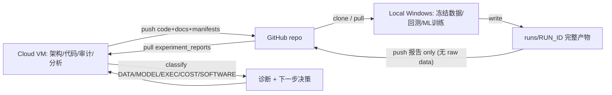

# CLOUD_LOCAL_ARCHITECTURE.md

> Phase 6 — Cloud ↔ Local 研究运行系统。**只设计，不实现。** 定义 Cloud VM 与 Local Windows 的职责边界与协作闭环。
> 硬约束：Cloud **不下载** 124GB 冻结数据；GitHub **不存** raw data / cache / weights / secrets。

---

## 1. 环境职责边界
| | Cursor Cloud VM | Local Windows 工作站 |
|--|-----------------|----------------------|
| 负责 | 架构设计、代码开发、code review、Repo 审计、文档、**实验结果分析** | **冻结数据存储**、大规模回测、ML/DL 训练、长周期实验、产出 experiment reports |
| 不负责 | 存 124GB 数据、大规模回测、GPU 训练、长跑实验 | 无（是真实实验环境） |
| 有什么 | 代码/文档/GitHub、numpy/pytest、无冻结数据 | 冻结 D1 pack（~124GB）、GPU（可选）、venv、BaoStock（数据采集） |
| 数据状态 | **DATA_BLOCKED**（Phase 4） | 数据系统-of-record |

**铁律**：
- Cloud **禁止** clone/download 124GB 市场数据；Cloud 只处理代码/文档/小 json/报告。
- GitHub **禁止** 存 OHLCV raw、cache、model weights、secrets、broker credentials（`.gitignore` 已保证 `raw/`、`alpha_cache/`、`runs/`、`.venv-*/`）。

## 2. 闭环

- 代码/文档/合同/manifest 从 Cloud → GitHub → Local。
- 实验产物（报告/metrics/errors，**非 raw data**）从 Local → GitHub → Cloud 分析。
- Cloud 读报告 → 归类失败 → 给下一步决策，写回 `research_memory/`（防重复）。

## 3. GitHub 存储 allow / deny
**允许**：source code、docs、tests、small json metadata、experiment manifests、reports。
**禁止**：OHLCV raw、cache、model weights、secrets、broker credentials。
（详细大数据策略见本 Phase 的 `LOCAL_RUNTIME_PROTOCOL.md §大数据`；沿用并取代 `docs/a_short/DATA_STORAGE_POLICY.md`。）

## 4. Model / Compute 边界（摘要，详见 PHASE6_DECISION_REPORT）
- **ML / DL 训练 = Local only**（Cloud 无 GPU、无数据、不长跑）。
- **Cloud = 分析/编排/审计/文档**；可调用 Cloud LLM 做**报告分析/信息整理**，不做 alpha。
- **LLM = 信息整理层，永不直接预测股票、永无交易权**（Decision A-001 + phase5 `A_SHORT_MODEL_PIPELINE_V2.md`）。

## 5. 失败诊断框架（每次失败必须归类）
| 类 | 例 | 代码映射（`forensic/errors.py`） |
|----|----|----------------------------------|
| DATA_ERROR | 数据缺失 / 时间泄漏 / PIT 错误 / DATA_BLOCKED | `DATA_ERROR` |
| MODEL_ERROR | alpha 不存在 / 过拟合 / 风格暴露 | `MODEL_ERROR`（STYLE_EXPOSURE_ONLY 等） |
| EXECUTION_ERROR | 无法成交 / 涨跌停 / 停牌 | `EXECUTION_ERROR` |
| COST_ERROR | 毛正净负 / 换手 / 最低佣金 | `COST_ERROR` |
| SOFTWARE_ERROR | bug / 环境问题 | **映射 `ENV_ERROR` + `code_bug=true`**（Phase 6 命名；代码类名未改，留待未来 reconcile） |
> 已由 Phase 3 forensic 层实现（`classify_run` 输出 `primary_conclusion`）。Phase 6 增加跨实验的 **FAILURE_ATLAS**（见 `FAILURE_ATLAS_DESIGN.md`）与 **research_memory**（见 `RESEARCH_MEMORY_DESIGN.md`）。

## 6. 八项验收速答（详见 PHASE6_DECISION_REPORT / phase5）
1. 代码在哪开发？ **Cloud VM**。
2. 数据在哪保存？ **Local Windows（system-of-record）**；GitHub 只存小 json/报告。
3. 实验在哪运行？ **Local Windows**（大回测/ML）；Cloud 只跑测试/静态分析。
4. 结果如何回传？ **runs/RUN_ID → 报告推 GitHub `experiment_reports/` → Cloud 拉取分析**。
5. 亏损原因如何判？ **五类归类 + forensic 证据链 + FAILURE_ATLAS**。
6. 如何避免重复踩坑？ **research_memory/（accepted/rejected/failures/decisions）+ FAILURE_ATLAS，实验前先查**。
7. 何时用 Cloud 模型？ **报告分析/信息整理/审计**（非 alpha、非交易）。
8. 何时用本地 Cursor？ **需要冻结数据/大回测/ML 训练/长跑时**。
