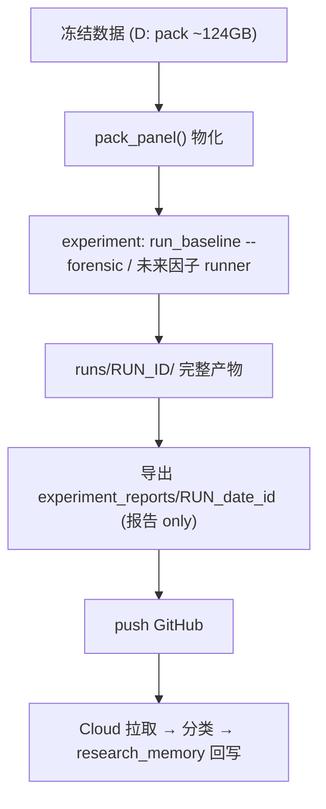

# LOCAL_RUNTIME_PROTOCOL.md

> Phase 6 — 本地运行协议。定义 Local Windows 上 `数据 → experiment → runs/RUN_ID → report → GitHub → Cloud 分析` 的完整流程。**只设计。**
> 复用 Phase 3 forensic 已实现的 `runs/RUN_ID/` bundle 与 `run_baseline --forensic`。

---

## 1. 本地流程

## 2. 本地前置
- 冻结 D1 pack 字节在本地 D:（Cloud 无 → DATA_BLOCKED，见 Phase 4）。
- 物化：`python -c "from research_engine.cn_a_share_alpha.pack import pack_panel; pack_panel()"` → `pack_exists()=True`。
- venv：`numpy`（+ `pytest`）；ML 阶段再加相应依赖（本地）。

## 3. runs/RUN_ID 产物（forensic 已实现 → 映射用户要求）
| 用户要求文件 | 现有 forensic 产物 | 说明 |
|--------------|--------------------|------|
| manifest.json | `RUN_MANIFEST.json` | 含 code/branch/py/OS/deps + contract/dataset/derived/seed/windows/model/exec/cost + `manifest_hash` |
| environment.json | （并入 `RUN_MANIFEST` 的 env 段） | python/os/platform/deps；可后续拆分为独立文件 |
| parameters.json | `CONFIG.json`（+ 派生 `parameter_hash`） | 本次入参 |
| dataset_snapshot.json | `DATA_SNAPSHOT.json` | 池组成/ST/停牌/涨跌停/价格·成交额分位（市值 UNKNOWN） |
| signals.json | `SIGNALS.json` | rank/score/eligibility/reject_reason |
| trades.json | `TRADES.json` | 生命周期 SIGNAL→…→CLOSED / STUCK |
| attribution.json | （现于 `METRICS.json`；可拆独立文件） | market_beta/momentum(APPROX)/size·selection=UNKNOWN |
| metrics.json | `METRICS.json` | by_k + lifecycle rollup |
| REPORT.md | `REPORT.md` | 11 节 + WHY_RESULT_HAPPENED |
| （错误） | `ERRORS.json` | 五类失败分类 + primary_conclusion |
> 命名对齐：现有 bundle 已覆盖全部所需信息；`environment.json`/`attribution.json`/`parameter_hash` 若要独立文件，属未来最小接线（不改 baseline 计算）。**本阶段不改代码。**

## 4. 每次实验必须能回答
什么时候跑（`generated_at_utc`）/ 代码版本（`code_commit`）/ 数据版本（`dataset_hash`+`derived_dataset_hash`）/ 参数（`CONFIG`+`parameter_hash`）/ 模型（`model_version`）/ 结果（`METRICS`）/ 失败类（`ERRORS.primary_conclusion`）。

## 5. 回传（Local → GitHub → Cloud）
- 只推 `experiment_reports/RUN_<date>_<id>/{REPORT.md, METRICS.json, ERRORS.json, warnings.json, error.log, (可选)screenshots}`。
- **不推**：`runs/RUN_ID/` 大件、raw data、pack npy、cache（`.gitignore` 已挡 `runs/`）。
- Cloud 拉取后：分类（DATA/MODEL/EXECUTION/COST/SOFTWARE）→ 写 `research_memory/`。

## 6. 大数据策略（124GB，取代 DATA_STORAGE_POLICY 的方案段）
| 方案 | 说明 | 取舍 |
|------|------|------|
| **A 本地 SSD（推荐主用）** | 冻结 raw/pack 留本地，system-of-record | 零成本、私密、保 lineage；不可跨机 |
| **D 只上传结果（推荐配套）** | 报告/metrics 入 GitHub | 轻、可分析；非全量 |
| B 压缩 snapshot | pack npy 打包（可选托管） | 便携、可校验 hash；需外部托管 |
| C 对象存储 | S3/OSS/R2 按 dataset_id | 跨机可拉、保 id+hash；需账号/带宽/访问控制 |
**推荐 = A（本地 SSD）+ D（结果入 GitHub）**；需跨机时加 B/C，且**保 `dataset_id`+`hash` 不变**。**禁**：上传 raw 到 GitHub、采购、换源、改 hash。

## 7. 复现契约
same code_commit + dataset_hash + parameter_hash + seed + windows ⇒ `manifest_hash` 一致 + 关键 `METRICS` 确定性一致；否则报告 `REPRODUCIBILITY=FAIL` 并归 `SOFTWARE_ERROR/NON_DETERMINISTIC`。
