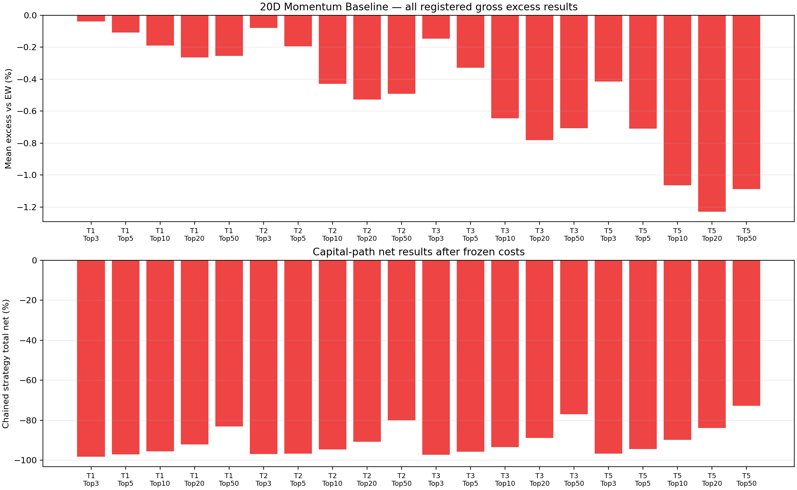

# EXP_0001 — A-Short first local empirical baseline

## Decision

**PHASE7 STATUS: PASS.** The audit, frozen-pack activation, unchanged forensic
run, observation and Git-safe handoff completed. This means the evidence is
usable; it does **not** mean the baseline passed as an alpha.

`20D_MOMENTUM_BASELINE` has **no demonstrated gross edge and no net edge** in
the registered 2014-01-01 through 2021-12-31 research window. All 20 horizon /
Top-K comparisons underperform eligible equal weight; BH-FDR q=0.05 yields
0/20 positive discoveries. Trading remains unauthorized.

## Reproducibility and data

- Run: `A_SHORT_baseline_momentum_20260916T134901Z`
- Command: `python -m research_engine.cn_a_short.run_baseline --forensic`
- Contract: `A_SHORT_D1_V1` / `95328cb73f8f229f9aea9983a2585f19b897363d7ada51d7ecc5d35ba9c220a4`
- Baseline code commit: `2f5c137206271b31b05c3ef5079aebf947c872d6`
- Frozen upstream: `tm-ashare-EQUITY-D1-20260830-000002` / `dd39193c19ca3ece1f8a7964462565346afa018c593a0080182215ceccf9ae80`
- Derived bytes hash: `08401de41050c339f1a85f5e5e278bd9b42813967699f82cb596da6bd2938b1d`
- Coverage: 5,549 symbols, 8,714 trading dates; finite close while listed
  99.9767%; non-degenerate.
- Signal uses close(T), entry uses open(T+1). No PIT leakage was found.
- Manifest records `dirty=true` because the working tree contained unrelated
  pre-existing user work; all A-Short baseline/diagnostic source was committed
  at the recorded commit before this final run.

## Alpha and benchmark

The tested signal is the 20-day momentum ranking itself. Two tiny absolute
gross means are positive (T1/Top3 +0.0131%, T2/Top3 +0.0168%), but both trail
EW (+0.0507%, +0.0959%) and are statistically insignificant. Therefore they
are not gross edge. Every other gross mean is negative.

| Bucket | Gross Top-K | Gross excess vs EW | t(excess) | Chained net |
|---|---:|---:|---:|---:|
| T1_Top3 | 0.0131% | -0.0375% | -0.34 | -98.3288% |
| T1_Top5 | -0.0582% | -0.1089% | -1.18 | -97.0575% |
| T1_Top10 | -0.1386% | -0.1893% | -2.66 | -95.5664% |
| T1_Top20 | -0.2134% | -0.2641% | -4.71 | -92.1812% |
| T1_Top50 | -0.2032% | -0.2538% | -6.18 | -83.0846% |
| T2_Top3 | 0.0168% | -0.0791% | -0.53 | -96.9753% |
| T2_Top5 | -0.0980% | -0.1939% | -1.56 | -96.8241% |
| T2_Top10 | -0.3338% | -0.4297% | -4.38 | -94.6700% |
| T2_Top20 | -0.4309% | -0.5268% | -6.84 | -90.7217% |
| T2_Top50 | -0.3948% | -0.4908% | -8.77 | -80.0658% |
| T3_Top3 | -0.0056% | -0.1466% | -0.81 | -97.2212% |
| T3_Top5 | -0.1883% | -0.3294% | -2.17 | -95.7103% |
| T3_Top10 | -0.5030% | -0.6440% | -5.49 | -93.3964% |
| T3_Top20 | -0.6392% | -0.7802% | -8.52 | -88.9252% |
| T3_Top50 | -0.5658% | -0.7069% | -10.74 | -77.0649% |
| T5_Top3 | -0.1861% | -0.4136% | -1.76 | -96.7107% |
| T5_Top5 | -0.4816% | -0.7090% | -3.68 | -94.4926% |
| T5_Top10 | -0.8369% | -1.0644% | -7.16 | -89.9182% |
| T5_Top20 | -1.0029% | -1.2304% | -10.83 | -83.8456% |
| T5_Top50 | -0.8613% | -1.0888% | -13.59 | -72.8247% |

The requested size-bucket comparison is `UNKNOWN`: the frozen D1 pack has no
PIT shares-outstanding or market-cap field. Amount percentile is reported only
as a liquidity proxy and is not relabeled as size. This limitation does not
invalidate the direct momentum-vs-EW result.

## Stock quality

Quality is measured over all 1,950 signal dates. “High volatility” means the
top 20% of eligible names by trailing 20-session daily volatility; “low
liquidity” means the bottom 20% by same-day amount.

| Bucket | ST | Price <= ¥5 | High-vol | Low-liquidity | Mean amount percentile | Small-cap |
|---|---:|---:|---:|---:|---:|---|
| Top3 | 1.16% | 2.12% | 91.73% | 3.52% | 88.4% | UNKNOWN |
| Top5 | 1.70% | 2.65% | 93.22% | 3.21% | 87.9% | UNKNOWN |
| Top10 | 2.19% | 3.39% | 93.61% | 3.05% | 87.1% | UNKNOWN |
| Top20 | 2.88% | 4.18% | 92.19% | 2.97% | 85.9% | UNKNOWN |
| Top50 | 3.25% | 4.99% | 86.56% | 2.75% | 83.5% | UNKNOWN |

The ranking overwhelmingly selects high-volatility names (86.6%–93.6%). It
does not mainly select low-price or low-liquidity names. ST exposure is
1.16%–3.25%. Small-cap exposure cannot be measured from this frozen contract.

## Execution

Across the 20 registered capital paths:

- entry-block rate: 4.82%–9.44% of picks;
- no-lot rate: 27.80%–83.42% under ¥100,000, 100-share lots
  and equal 1/K allocation;
- exit carry: 2.28%–3.89% of entered positions;
- stuck after the 10-session recovery cap: 0.084%–0.500%;
- the final-signal lifecycle snapshot is complete: 46 CLOSED and 4
  ENTRY_BLOCKED.

The high no-lot rate is a material implementability finding, especially for
large K after capital erosion. Entry/exit/carry logic completed as contracted;
there is no evidence of an execution software defect.

## Cost attribution

Costs are the frozen canonical assumptions: minimum ¥5 commission plus
transfer fee, sell-side stamp duty by date, and 10 bps slippage on each side.
For the forensic classifier’s T1/Top3 path:

- executable gross cash P&L: −¥49,552.02;
- commission + transfer: −¥12,850.45;
- stamp duty: −¥11,950.90;
- slippage: −¥23,975.36;
- total modeled cost: −¥48,776.71;
- net cash P&L: −¥98,328.82; ending equity ¥1,671.19.

The prediction-level mean gross can be slightly positive while executable
gross cash P&L is negative because blocked/no-lot names do not enter and exits
follow the capital-path rules. Costs then deepen the loss; they do not create
the negative excess versus EW.

## Failure classification

1. **MODEL_ERROR (primary):** the fixed 20D ranking produces negative gross
   excess in 20/20 registered comparisons; positive FDR discoveries = 0.
2. **COST_ERROR (secondary):** frozen transaction costs materially erode the
   executable paths, including the only two buckets with tiny positive
   prediction-level absolute gross means.
3. **EXECUTION_ERROR: not detected.** Blocks, no-lot, carry and stuck outcomes
   are observed feasibility constraints, not unexplained code behavior.
4. **DATA_ERROR: not detected.** Dataset/hash/PIT/coverage checks passed.
5. **SOFTWARE_ERROR: not detected in the final run.** The run completed and
   42 A-Short tests passed.

## Next step

Freeze EXP_0001 as the negative baseline. Do not tune lookback, K, horizon,
universe or filters against these results. The next authorized empirical step
should be a separately preregistered hypothesis that addresses the observed
high-volatility concentration and the small-account no-lot feasibility;
PIT market-cap data must be added under a new data contract before making any
size-bucket claim.

